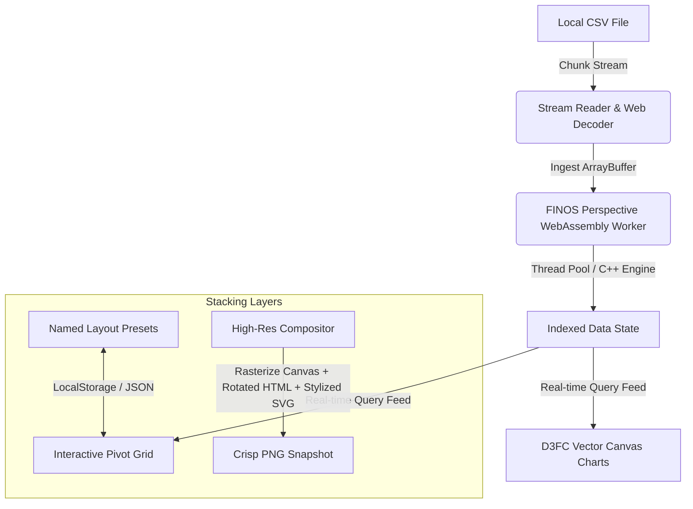

# 📊 Trader Ad-Hoc Analytics Sandbox

[](https://erdcpatel.github.io/perspective/)
[](LICENSE)
[](https://erdcpatel.github.io/perspective/)
[](https://perspective.finos.org/)

A lightning-fast, high-fidelity, single-page data analytics canvas designed for institutional-grade client-side slicing, dicing, and visualizing of massive local datasets (tested up to **2GB+ / 5M+ rows** of CSV streams) inside your browser with **zero backend dependencies and absolute data privacy**.

Powered by FINOS Perspective compiled to WebAssembly (C++ virtual engine), D3FC vector graphics, and standard client-side storage boundaries.

---

## 🚀 Key Features

### 1. Memory-Safe Chunked Streaming Ingestion
* **High-Efficiency Reader:** Utilizes a highly optimized 10MB `ReadableStream` parser that ingests massive CSV files in streaming chunks.
* **Low RAM Footprint:** Recycles memory segments inside the JavaScript garbage collector, maintaining a steady memory envelope (~50MB overhead) and preventing browser tab crashes even on gigabyte-sized files.

### 2. Multi-Layout Persistence Workspace
* **Named Layout Manager:** Save, name, and toggle between multiple custom pivot splits, charts, or filtering grids using browser `LocalStorage`.
* **Portable Presets:** Instantly `Export Layout` to portable JSON files or `Import Layout` to replicate visual configurations instantly.
* **Smart UI Integration:** Sleek headers with reactive styling that flash with immediate visual feedback during action saves, deletes, and loads.

### 3. High-Resolution Custom Chart Compositor (`📸 Save Chart`)
* **Shadow DOM Crawler:** Recursively traverses complex shadow DOM roots to capture WebGL canvas plots, vector SVG axis markings, and absolute-positioned HTML container nodes.
* **Vector Style Inliner:** Clones vector axes and inlines live browser computed stylesheet styles (stroke colors, text alignments, opacity, and fonts) onto explicit layout canvas matrices, rendering crisp grid ticks and axis lines.
* **Rotated Text & Swatch Compositor:** Employs 2D transform matrices to capture rotated text (such as vertical Y-axis labels like `trade_id`) and rasterizes HTML legend color keys exactly as they appear in the UI.

### 4. Direct View-Filtered Exporter (`📥 Export Data`)
* Respects your active dataset query configurations (filters, groupings, sorts, columns).
* Instantly converts the WebAssembly memory state to a clean, filtered CSV stream (`view.to_csv()`) for offline ingestion.

### 5. Enterprise-Grade Security Sandbox
* **No Server Processing:** All parsing, indexing, and rendering calculations are performed strictly inside the browser sandbox (WebAssembly Worker threads).
* **Pure Privacy:** Your sensitive data never leaves your local machine. Ideal for compliance-conscious environments.

---

## 🛠️ Architecture & Under the Hood



### High Performance on Static Hosts (Cross-Origin Isolation)
WebAssembly multithreading relies on browser `SharedArrayBuffer` support, which requires Cross-Origin Isolation headers (`COOP`/`COEP`). 
Because standard static web hosts (like GitHub Pages) do not allow customizing server headers, this repository integrates a lightweight **Service Worker middleware** (`coi-serviceworker.js`). The worker intercepts client-side traffic and dynamically injects the isolation headers, enabling native multithreaded speed on standard GitHub static pages!

---

## 📦 Deployment to GitHub Pages

Deploying your own instance of the sandbox is incredibly simple:

1. **Fork or Clone this repository:**
   ```bash
   git clone https://github.com/erdcpatel/perspective.git
   ```
2. **Enable GitHub Pages:**
   * Go to your repository on GitHub.
   * Click **Settings** > **Pages** (in the left sidebar).
   * Under **Build and deployment**, select **Deploy from a branch**.
   * Under **Branch**, select `main` (or your active branch) and the `/ (root)` folder, then click **Save**.
3. **Access Your Live Canvas:**
   * Your sandbox will be live at `https://<your-username>.github.io/perspective/` within minutes!

---

## 🎨 Tech Stack
* **Core:** HTML5, CSS3, ES6 Modules (Vanilla JS).
* **Aggregation & Query Engine:** [FINOS Perspective](https://perspective.finos.org/) (C++ Engine in WebAssembly).
* **Visual Graphics:** D3FC (D3 and Custom Canvas Components).
* **Cross-Origin Helper:** Guido Zuidhof's `coi-serviceworker` (MIT).

---

## 📜 License

This project is licensed under the MIT License. Feel free to use, modify, and distribute it for personal and enterprise use.
